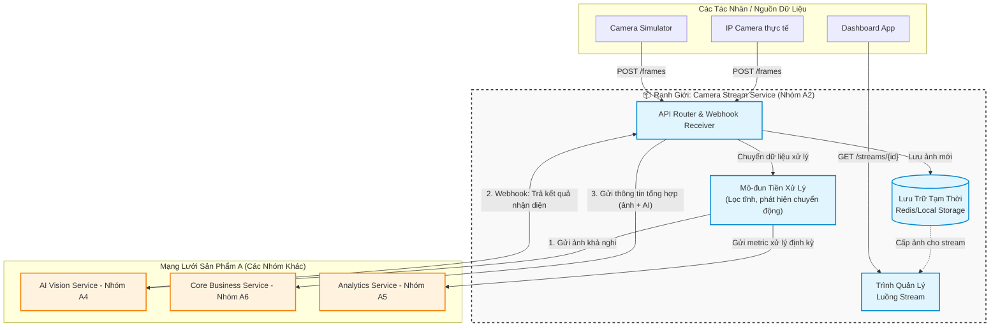

# Service Boundary của nhóm

## 1. Thông tin nhóm

- **Tên nhóm:** Nhóm 3
- **Lớp:** CNTT 17-13
- **Thành viên:** Lâm Xuân Trường (Đại diện) - Vũ Bích Hợp - Đỗ Quang Huy - Nguyễn Tùng Lâm
- **Service nhóm phụ trách:** A2 - Camera Stream Service (Product A)
- **Đề tài:** Xây dựng dịch vụ tiếp nhận và xử lý luồng camera.
- **Sản phẩm tổng thể của lớp:** Smart Campus Operations Platform (Product A)

---

## 2. Actor

Những tác nhân tương tác trực tiếp với hệ thống/service của nhóm:
1. **IP Camera (Thiết bị vật lý):** Gửi luồng video (RTSP) hoặc gửi liên tục các frame ảnh (HTTP POST) về hệ thống.
2. **Camera Simulator (Mô phỏng):** Script hoặc tool tự động bắn ảnh test/mock data vào hệ thống.
3. **Người dùng quản trị / Hệ thống Dashboard:** Yêu cầu truy xuất luồng video trực tiếp (live stream) hoặc xem lại các frame ảnh được chụp lúc có sự kiện.

---

## 3. System Boundary

Nhóm đảm nhận phần xử lý trung gian giữa thiết bị thu hình và các dịch vụ AI/Nghiệp vụ.

**Phần nhóm 3 (A2) KIỂM SOÁT:**
- Xây dựng API Gateway/Router nội bộ để tiếp nhận lưu lượng lớn ảnh/video từ nhiều camera.
- Module tiền xử lý (Pre-processing): Tối ưu hóa dung lượng ảnh, phát hiện chuyển động cơ bản (Motion detection) bằng thuật toán nhẹ (VD: OpenCV cơ bản) để tránh việc gọi AI lãng phí.
- Quản lý bộ đệm (Frame Buffer/Storage) lưu trữ tạm thời ảnh/video để phục vụ cho các dịch vụ khác truy xuất.

**Phần nhóm 3 (A2) CHỈ TÍCH HỢP (Không tự xây dựng core logic):**
- **A4 - AI Vision Service:** Chỉ gọi API của họ để phân tích ảnh, không tự train hay chạy model YOLO nặng.
- **A6 - Core Business Service:** Chỉ đẩy dữ liệu thô hoặc kết quả (sau khi AI phân tích) sang, không tự quyết định quy trình phạt/cảnh báo.
- **A5 - Analytics Service:** Đẩy log, thông số hệ thống, không tự vẽ biểu đồ báo cáo.

---

## 4. Service Boundary

**Trách nhiệm CHÍNH của Camera Stream Service:**
- Định tuyến và quản lý kết nối của các camera trong khuôn viên (thêm/sửa/xóa cấu hình camera).
- Tiếp nhận luồng dữ liệu hình ảnh liên tục và ổn định.
- Lọc bớt dữ liệu rác (ảnh tĩnh, không có chuyển động) trước khi chuyển đi.
- Làm "người đưa thư": Gửi ảnh sang AI Vision, nhận lại kết quả AI, gộp kết quả đó kèm hình ảnh gửi cho Core Business.

**Service KHÔNG làm gì?**
- Không lưu trữ dữ liệu vĩnh viễn (chỉ lưu trữ tạm thời/cache trong vòng vài ngày hoặc vài giờ).
- Không thực hiện nhận diện khuôn mặt, đếm người (Đó là việc của AI Vision).
- Không gửi tin nhắn Telegram, Email cho bảo vệ (Đó là việc của Notification Service).

---

## 5. Input / Output

### Input (Dữ liệu đầu vào)
- Dữ liệu dạng JSON chứa thông tin frame và hình ảnh (Base64 hoặc URL) từ Camera/Simulator:
```json
{
  "camera_id": "cam-gate-main-01",
  "location": "Cổng chính",
  "frame_data": "base64_string_hoac_url...",
  "motion_detected": true,
  "timestamp": "2026-05-02T09:05:00Z"
}
```
- Phản hồi từ **AI Vision Service**:
```json
{
  "camera_id": "cam-gate-main-01",
  "detected": true,
  "objects": [{"type": "person", "confidence": 0.95}],
  "risk_level": "medium",
  "timestamp": "2026-05-02T09:05:05Z"
}
```

### Output (Dữ liệu đầu ra)
- Request gửi sang **AI Vision Service** (chỉ gửi khi có chuyển động):
```json
{
  "camera_id": "cam-gate-main-01",
  "image_url": "http://camera-stream:8000/frames/cam-gate-main-01/latest.jpg",
  "timestamp": "2026-05-02T09:05:00Z"
}
```
- Sự kiện tổng hợp gửi sang **Core Business Service**:
```json
{
  "event_type": "camera_alert",
  "camera_id": "cam-gate-main-01",
  "ai_result": { "detected": true, "objects": ["person"] },
  "frame_url": "http://camera-stream:8000/frames/cam-gate-main-01/12345.jpg",
  "timestamp": "2026-05-02T09:05:05Z"
}
```

---

## 6. API dự kiến (OpenAPI Contract Draft)

| Method | Endpoint | Mục đích |
|---|---|---|
| `GET` | `/health` | Kiểm tra trạng thái hoạt động của service |
| `POST` | `/api/v1/cameras` | Đăng ký một camera mới vào hệ thống quản lý |
| `POST` | `/api/v1/frames` | Endpoint nhận ảnh từ thiết bị/simulator đẩy lên |
| `GET` | `/api/v1/streams/{camera_id}` | Lấy luồng xem trực tiếp (MPEG/MJPEG stream) |
| `POST` | `/api/v1/webhook/ai-result` | Webhook để AI Vision gọi lại trả kết quả (bất đồng bộ) |

---

## 7. Phụ thuộc service khác

**Downstream (Gọi đến ai?):**
- **AI Vision Service (A4):** Gửi ảnh để phân tích khi mô-đun tiền xử lý nghi ngờ có vật thể/chuyển động.
- **Core Business Service (A6):** Bắn Event hoặc gọi REST API thông báo có sự kiện đáng ngờ (kèm link ảnh và kết quả AI).
- **Analytics Service (A5):** Gửi các metric định kỳ (VD: số frame xử lý trong phút, số lần gọi AI).

**Upstream (Ai gọi đến?):**
- **Camera/IoT Devices:** Đẩy dữ liệu vào hệ thống.
- **AI Vision Service (A4):** Gọi ngược lại webhook để trả kết quả.
- **Dashboard / Frontend:** Truy xuất lấy luồng stream `/streams/{camera_id}`.

---

## 8. Sơ đồ minh họa (Architecture & Boundary Diagram)

Sơ đồ dưới đây thể hiện chi tiết ranh giới bên trong Service của nhóm và luồng giao tiếp với các dịch vụ ngoại vi.


